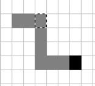
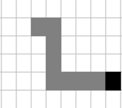

# Snake Game Kata

## Exécution

- `npm i`
- `npm start`

Le navigateur doit s'ouvrir sur http://localhost:9000/.

## Principe

Le moteur de jeu et l'affichage sont déjà implémentés. Pour ce Kata, il
faut uniquement implémenter la méthode `update` dans le fichier 
[snakeLiveManager.ts](src/snakeLiveManager.ts). Le moteur crée une 
isntance de la classe `SnakeLiveManager` et appelle la méthode `update`
plusieurs fois par seconde.

## Implémentation

Dans [snakeLiveManager.ts](src/snakeLiveManager.ts), la méthode `update` est
appelée plusieurs fois par seconde. Elle reçoit l'état courant du jeu (`state`)
et doit renvoyer le nouvel état.

Un paramètre optionnel `newDirection` est présent si l'utilisateur a taper
une flèche pour changer de direction.

Si `newDirection` n'est pas présent, l'état doit être mis à jour pour faire 
avancer le serpent dans la direction courante (voir ci-dessous).

Si `newDirection` est spécifié, il faut faire "tourner" le serpent, le faire 
avancer dans la nouvelle direction et noter sa nouvelle direction dans l'état.

Si le serpent touche un bord, il faut mettre `gameOver` à `true` dans l'état.
La classe `SnakeLiveManager` qui est instanciée contient les dimensions de
la grille de jeu.

### Déplacement

Pour "déplacer" le serpent, il faut faire la transition entre les 2 
situations suivantes : 

  ==> 

Attention, l'idée de "déplacement" peut être trompeuse. Ou la première solution
instinctive peut ne pas êter la meilleure... 😉

### Nourriture

L'état contient l'emplacement de la nourriture dans `food`.

Il faut positionner de la nourriture de façon aléatoire. La méthode `random()`
du fichier [utils.ts](src/Futils.ts) peut aider.

Lorsque le serpent "mange" la nourriture, il faut incrémenter le `score` dans
l'état, et positionner une nouvelle nourriture.

