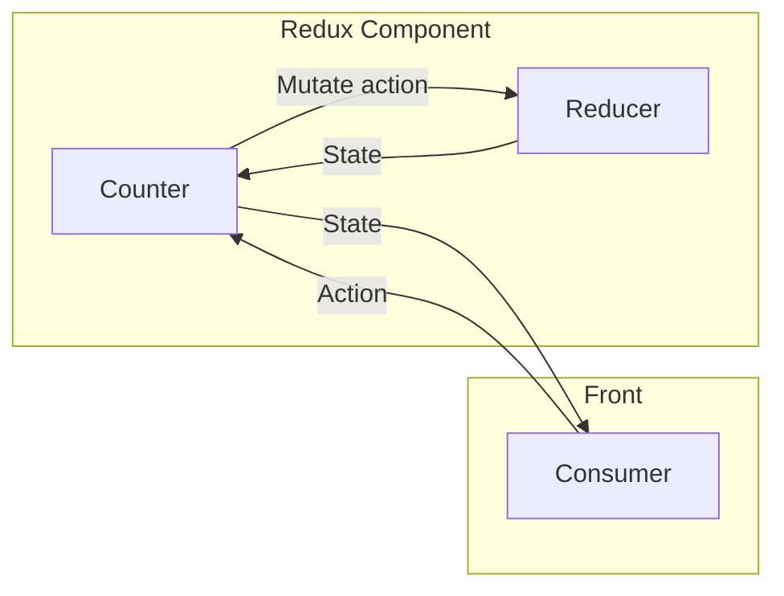

# Kotlin Coroutines Kata - State Flow

L'objectif de ce kata est de créer un début de composant "Redux" 
afin de créer un compteur avec 2 types d'actions, incrément et décrement.  

Voici une représentation visuelle de ce que l'on cherche à faire :



Le seul prérequis étant que le `State` doit être observable 
par tout consommateur (e.g. usage de la fonction collect sur un `Flow`).

### Résumé 

Nous avons besoin d'un `Compteur` ayant un `État` observable de type `Int`.
Ce `Compteur` doit pouvoir recevoir des `Action` de type `Increment` ou `Decrement` 
qui devrons influer sur l'`État`.   

## Tips & Tricks

### State Flow

Un `StateFlow` est un flux de données observable contenant toujours la dernière valeur émise.

### Shared Flow

Un `StateFlow` est un flux de données observable pouvant ne jamais émettre.
Une fois une valeur émise elle ne peut plus être consommée.

### Tester les `Flow`

Pour tester le résultat d'un `Flow` vous pouvez utiliser 
la fonction `test` de la librairie `turbine`.

```kotlin
val data = flowOf(1, 2, 3)
data.test {
    assertEquals(1, expectItem())
    assertEquals(2, expectItem())
    assertEquals(3, expectItem())
    expectComplete()
}
```
