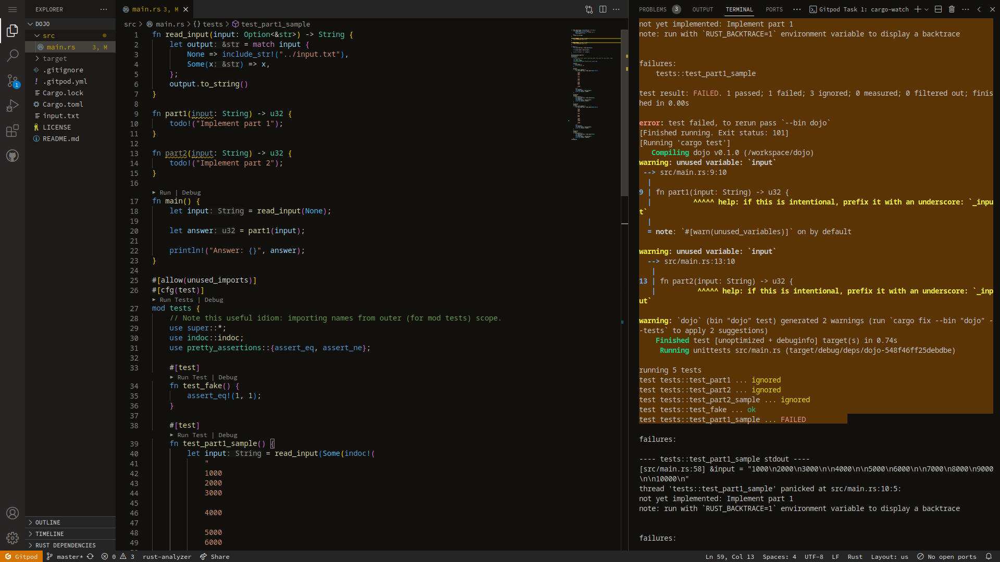

# Coding Dojo #1bis

## Title: Price Calculation Kata

Goal is to create a module with 2 public fonctions:

- 1 x to calculate the price of items.
- 1 x to covert a price in various currencies.

1- Implement the total price calculation based on the following parameters:

- Number of items
- Unit price
- Tax

2 - Take into account discounts:

- €1000: 3% discount
- €5000: 5% discount

3- Add currency converter:

- 1 € = 2 Krupnic
- 1 € = 3 Zorglub

### Examples

Prices:

- Excl. VAT: 3 items at €1.21 each + 0% ⇒ “€3.63”
- Incl. VAT 5%: 3 items at €1.21 each + 5% ⇒ “€3.81”
- Incl. VAT 20%: 3 items at €1.21 each + 20% ⇒ “€4.36”

Discounts:

- €1000 → 3% Discount: 5 x €345.00 + 10% tax → “€1840.58”
- €5000 → 5% Discount: 5 x €1299.00 + 10% tax → “€6787.28”

Currencies:

- 20€ = 40.00 Krupnic
- 20€ = 60.00 Zorglub

## Proposed editor

The idea is to use on online editor. Gitpod seems a good solution in that
case as only a browser is required to edit the code and the workspace can
be shared between participants.

